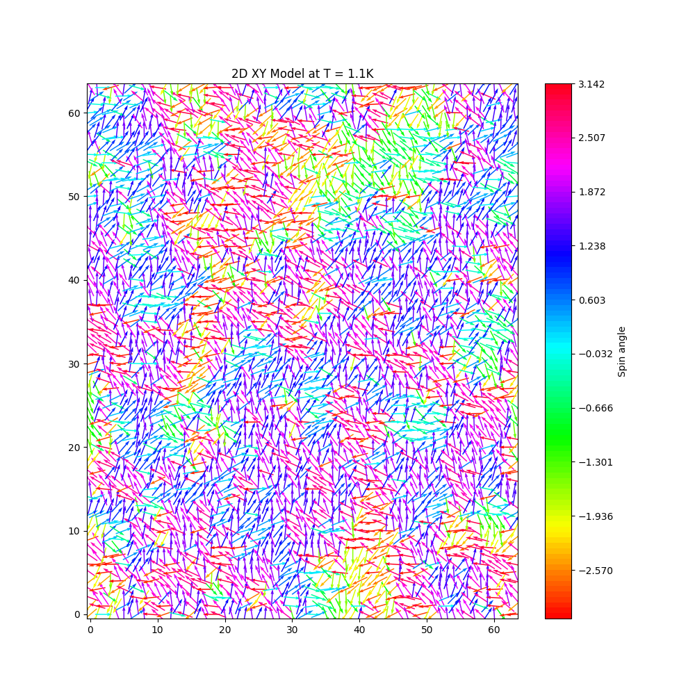
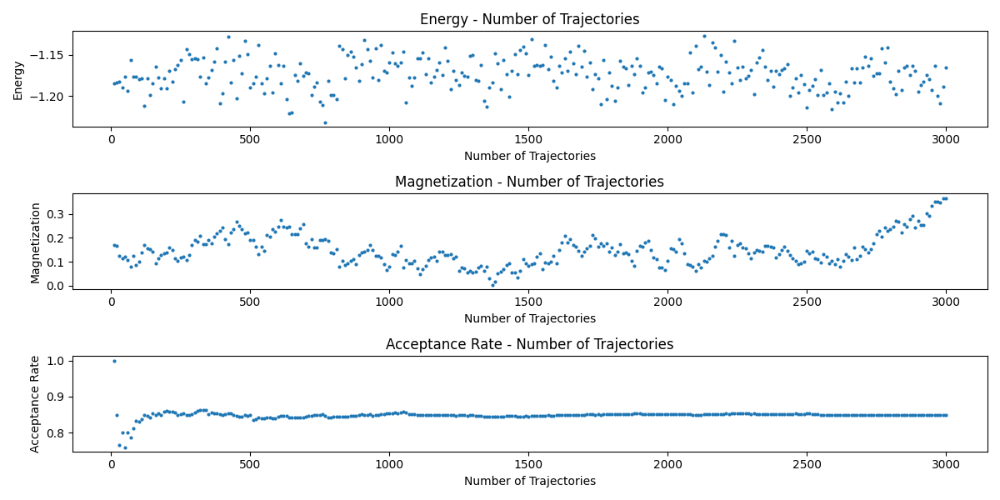

# 2D XY Model HMC Simulation

## 1 Initialization
Parameters of the system can be customized before the simulation by modifying the config.py file. For example:

```bash
system_parameters = {
    'seed': 1,                # seed for random number generator
    'T': 1.00,                   # default temperature
    'L': int(64),                # lattice size
    'a': 1.0,                   # lattice spacing
    'lfl': int(10),             # number of Leapfrog steps
    'lfeps': 0.1              # Leapfrog stepsize
}

run_simulation_parameters = {
    'T': 1.10,                   # simulation temperature
    'num_steps': int(5e3),      # number of trajectories
    'trunc_steps': int(2e3),      # number of truncated trajectories
    'meas_freq': int(10)        # frequency of measuring
}

run_simulation_temp_parameters = {
    'T_min': 0.70,               # minimum temperature of simulation
    'T_max': 1.40,               # maximum temperature of simulation
    'T_step': 0.5,              # step of temperature
    'num_bstrp': 150              # number of bootstrapping steps
}
```

## 2 Running the Simulation

To start the simulation, run the following command in terminal.

```bash
python main.py
```

## 3 Outputs

### 3.1 Visulization of Spin Configuration
The eventual spin configuration after the simulation will be visulized.


### 3.2 Plottings under Specified Temperature
First, raw data of enery, magnetization and acceptance rate (under the specified temperature) will be shown, versus the number of trajectories.


Second, ensemble averages of energy, components of magnetization, and exp(-delta H) (under the specified temperature) will be shown, versus the number of trajectories.

### 3.3 Plottings under Temperature Range
Ensemble averages of the energy, capacity, and susceptibility with error bars (under a range of temperatures) will be shown.
